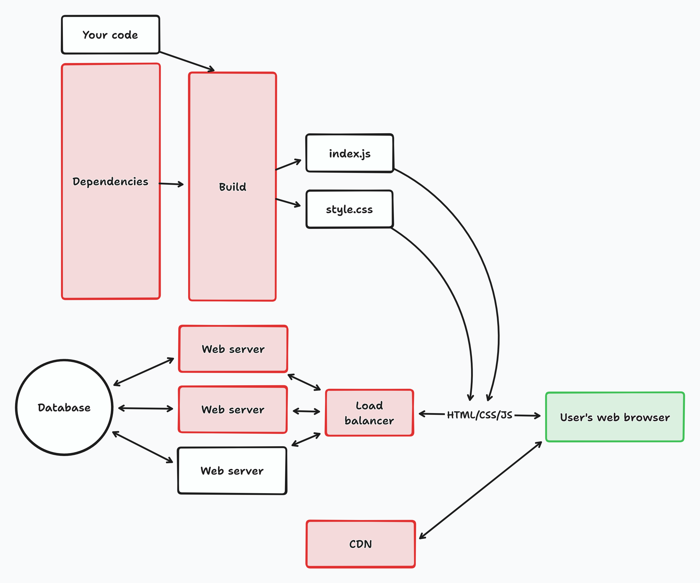
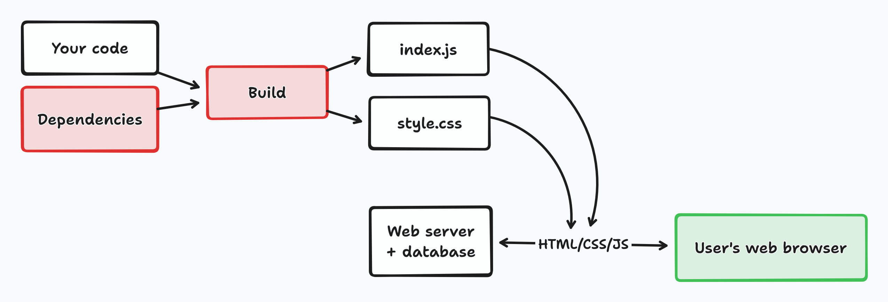

# Operationally Simple Web Sites

This site is sort of a super-blog post surveying various ways to make web sites with an eye toward simplicity and modern amenities. Today's web is full of voices shouting to use this or that hot new thing, and the loudest voices are often the least experienced, or the most motivated to sell a specific thing, regardless of its real value. So here's one guy named Steve telling you what's up.

I wrote all this with two kinds of people in mind. One is people early in their programming journey, who see many paths but aren't sure which to take, and get a lot of advice from people with unclear trustworthiness. The other is experienced programmers who want to ship a web app once in a while and feel bewildered by the pace of change.

Once you skim everything here, you should have a good sense of one simple web stack, and also be aware of options for how to add complexity where it makes sense to you.

If building your web site is your full-time job, this guide is not for you. You already know everything and you don't need me.

## What is operational simpicity mean, and why do you want it?

Operational simplicity means a few reliable parts instead of many fragile parts. It sometimes means giving up some convenience, but also has many benefits.

#### Cheap by default

If you're not building your web site for a company, you're probably spending your own money to host it. Redundancy is expensive.

#### It fits in your head

When a whole system fits in your head, you can reason about it better when something goes wrong. A bicycle is easier to fix than a car.

#### It's less likely to break

Popular web frameworks [regularly break](https://github.com/facebook/react/blob/main/CHANGELOG.md#breaking-changes) [backward compatibility](https://v3-migration.vuejs.org/breaking-changes/), requiring manual changes to keep things working if you want to use the latest version. You can try to stay on the old version, but there's always a risk that you'll be forced to upgrade one way or another.

When your dependencies just do less stuff, there's less stuff that can break.

#### Stack Overflow works better

When your tools have been around for a long time, lots of questions have been asked and answered.

### Here, I made diagrams

=== "Conventional wisdom"

    

=== "Easy mode"

    

## Surely you'd have to sacrifice UX and developer productivity?

Not really, depending on what you're doing. The value of a JS framework is not necessarily in making you more powerful, but in helping you organize your code. It's possible to do that without bringing in a fragile build pipeline and and tens of thousands of lines of framework code.

## Why you should listen to me

I've been making web sites for over twenty years. [Here's proof!](https://imaciscool.neocities.org/)

I've built large production web frontends from scratch in JavaScript, and small production web backends from scratch in Python. On top of being a professional software engineer, I'm also an obsessive hobbyist. Most recently, I made [DIYBand.net](https://diyband.net), a web site builder for bands. I also made [Browserboard](https://browserboard.com), which is an online whiteboard that I've since sold. Before that, I did a bunch of wild stuff for startups that have since died. :smile:
