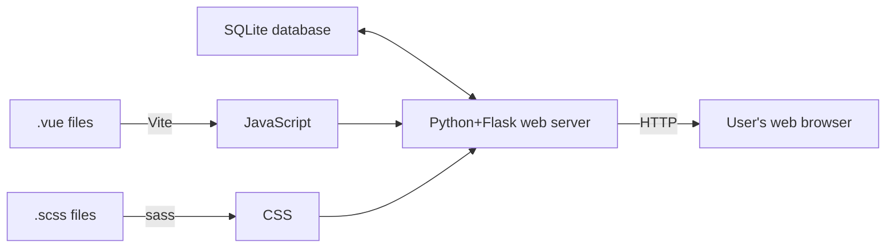

# What's a stack?

A **stack** refers to the collection of libraries, frameworks, and web services that work together in order to serve your app to users.

When you stick an adjective in front of "stack," it becomes more specific. Your _frontend stack_ is the collection of JavaScript libraries you use to build your interactive interfaces. Your _backend stack_ usually refers to the framework you chose to help you write server code, as well as your database.

All these things work together to send HTML, CSS, and JavaScript from your server to the user's web browser.

The stack I promote on this web site is Python, Flask, SQLite, and Vue, with Sass on the side, which all work together to build a multi-page app.

