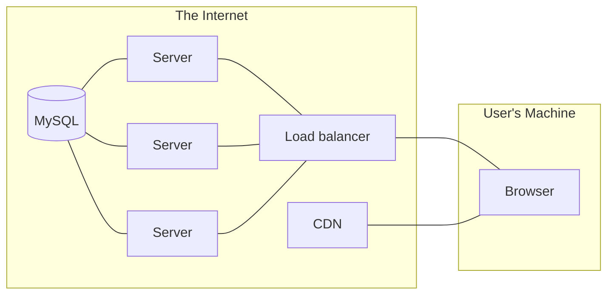
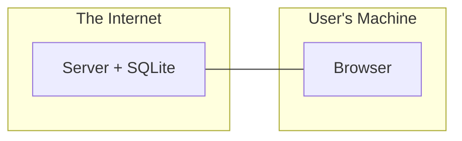

# What's a stack?

A **stack** refers to the collection of libraries, frameworks, and web services that work together in order to serve your app to users.

When you stick an adjective in front of "stack," it becomes more specific. Your frontend stack is the collection of JavaScript libraries you use to build your interactive interfaces. Your backend stack usually refers to the framework you chose to help you write server code, as well as your database.

The backend's job is to send HTML, CSS, and JavaScript to the user's browser. The frontend's job is to control the web browser.

## Components of a web stack

A web app that stores user data typically has three major parts:

1. The database, where information is stored (Postgres, MySQL, SQLite...)
2. The web server, which responds to HTTP requests (Flask, Django, Rails, Laravel...)
3. The frontend, which are the assets executed by the user's web browser (React, Vue, Svelte, Sass...)

In addition to the stuff you write code for, there are also build tools, which turn source code into something else. In the frontend world, this typically means turning a bunch of little JavaScript files into one big JavaScript file. Often, the source files are not just in ordinary JavaScript syntax, but are actually TypeScript, JSX, TSX, Vue "single-file components," Svelte, etc.

## Stack decay

When you write code, you hope it keeps working forever. But whenever you use a tool made by somebody else, you take on two kinds of risks. First, the risk that the maintainer will change the way the tool works such that your code doesn't work as-is anymore, forcing you to update your code. And second, the risk that the tool will be abandoned, and will stop working with other things that _are_ being updated.

JavaScript web frameworks and build tools are almost self-parodying examples of both of these risks in action. If you choose a framework or build tool today, you can be almost certain that in three years it won't work anymore without a "migration" to a new API or configuration format.

## Mitigating stack decay

If you want to keep working on a web site for a long time without being occasionally distracted by backward-incompatible changes, there are two strategies you can use.

1. Use old tools which still work well and have a track record of backward compatibility.
2. Use tools which are easy to replace without a lot of special knowledge, or have few dependencies.

In today's world, I'm advocating for taking approach #1 on the backend, and #2 on the frontend, which mitigates risk while still allowing for a modern development workflow.

## A quick comparison of architecture diagrams

This diagram represents the conventional wisdom for how to build a scalable web site:

Here's what I think serves most web sites with light traffic (i.e. all portfolio projects and most side projects):

