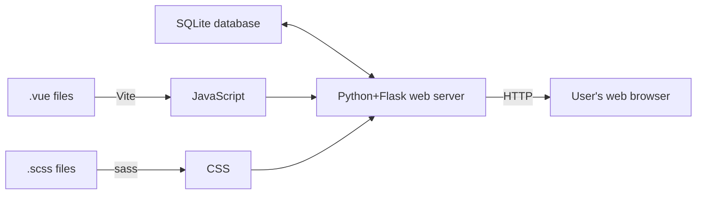

# What's a stack?

A **stack** refers to the collection of libraries, frameworks, and web services that work together in order to serve your app to users.

When you stick an adjective in front of "stack," it becomes more specific. Your _frontend stack_ is the collection of JavaScript libraries you use to build your interactive interfaces. Your _backend stack_ usually refers to the framework you chose to help you write server code, as well as your database.

All these things work together to send HTML, CSS, and JavaScript from your server to the user's web browser.

The stack I promote on this web site is Python, Flask, SQLite, and Vue, with Sass on the side, which all work together to build a multi-page app.

I enjoy shipping things. Once I ship them, I enjoy not needing to do any more work just to keep them running.
​

## Requirements

​
The classic requirements for an interactive web site are:
​

1. Persistent storage of user data
2. HTML provided by a web server
3. Interactivity provided by JavaScript
4. Styles provided by CSS

As someone who's been involved with making web sites for twelve years or so, I'm amused and dismayed by how complicated people and expensive people make these five things, especially in "beginner-oriented" material. Libraries and buzzwords are thrown around like so many herbs and spices, when each one is a new liability.

I want my tools to work reliably over time. I don't want to be surprised by a backwards-incompatible API or a price increase. But I also want to limit the amount of time I spend setting everything up; some convenience is worth the cost.
​

## A cheap, reliable backend stack

​
Flask and SQLAlchemy can easily serve web sites with thousands of monthly visitors. Unless you have VC funding, there's no practical need to plan for "scale."
​
In practice, you can deploy SQLite in production by mounting a persistent volume on your web machine and use [Litestream](https://litestream.io/) to replicate it to S3.
​
Using SQLite isn't even necessarily a scaling tradeoff. It has the unique advantage that roundtrip time to make a query is zero milliseconds, because the database driver is running in your application process.
​
Using a persistent volume typically costs very little, but also tends to not be available on the free tier of any platform-as-a-service. On Render, you'll be paying at least $7/mo for the Starter tier. On fly.io it's cheaper, more like $3/mo, but fly.io also has much worse reliablity.
​

### What you give up

​
Managed database services tend to give you nice admin tools like automatic backups, which you need to figure out for yourself with SQLite. You also need to SSH into your web server in order to run database migrations when you add or remove tables or columns.
​
You'll probably also give up zero-downtime deploys, because your SQLite volume needs to be detached from the old machine before it can be attached to the new one. In my experience, each deploy to Render involves about 30 seconds of downtime.
​

## A simple, reliable frontend stack

​
I can't remember the last time I opened up a complex project I hadn't touched in months or years and didn't need to immediately deal with a bunch of broken build or framework dependencies. It doesn't seem to matter whether the tools are maintained by one person or an army of maintainers, whether the tools are recommended by authors of the framework it supports not, or whether a library is a few months or a few years old. They all break. It's infuriating.
​
To route around all these issues, I'm trying out a simplified frontend stack:
​

1. [esbuild](https://esbuild.github.io) for bundling JavaScript and TypeScript
2. [sass](https://sass-lang.com/install) for bundling CSS
3. [Arrow](https://www.arrow-js.com/) or [React](https://react.dev/) for interactivity

Step 1 is to get rid of every build tool with a dependency graph. esbuild and sass are self-contained binaries with no NPM dependencies, and they're both best-in-class fast, so they're perfect.

Step 2 is to use a frontend framework that doesn't require any custom build plugins for the chosen build tools. You could use React with esbuild since it supports JSX, but the React ecosystem never stops changing (which is bad), so I'm going to recommend Arrow even though it's still in alpha.

Arrow's value proposition is it uses only native JavaScript syntax, but provides enough to give you similar convenience as writing with a more sophisticated framework. You define state in simple reactive stores, and use declarative templates to render HTML when the data changes.

### What you give up

​
In the interest of simplicity, this stack does _not_ include server-side rendering of JavaScript-provided HTML, or hot module reloading. Both of these features can be nice, but also add significant complexity to the stack. Server-side rendering requires writing your server in JavaScript and having templates that act differently in different contexts, and hot module reloading involves proxies and websockets and splitting your JS bundle into multiple parts.
​

## Developer experience

​
The way you develop an app with this stack is to run 3 processes simultaneously:
​

1. Python web server
2. esbuild
3. sass

At this point, you can write a web app like we used to do it in 2012, but better.
